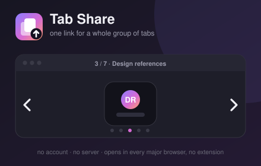

# Tab Share

Bundle a group of tabs into **one link** that opens as a slideshow — and the
person you send it to needs no extension, no account, and hits no server.



## What it does

1. Click the toolbar button. Pick your pages from:
   - **This window** — every open tab, pre-checked;
   - **Tab group** — a Chrome/Firefox tab group (optional permission);
   - **Paste links** — one URL per line, or pull in the current window.
2. Reorder / trim / name the collection.
3. **Create share link** → copy it.
4. The recipient opens it in any browser and gets a slideshow: a framed page
   view with a title bar, ◀ ▶ arrows, keyboard nav, a `3 / 12` counter and a
   progress bar, plus a **grid** overview and **open-all-in-tabs**.

## How one link can carry everything

The collection (page URLs + titles) is compressed with
[lz-string](https://github.com/pieroxy/lz-string) and written into the URL
**fragment** — the part after `#`. Browsers never transmit the fragment, so:

- no backend, no database, no accounts;
- the extension makes **zero network requests**;
- the link is self-contained (≈500 chars for 5 pages, ≈1.5 KB for 30).

A ~6 KB static page (`viewer/`) decodes the fragment in the recipient's browser
and renders the slideshow. You host it anywhere (see `BUILD.md`).

### The one honest limitation

Most big sites (Google, banks, X, …) send `X-Frame-Options` / CSP headers that
forbid being embedded in another page. So each slide shows a rich **preview
card** (title, domain, URL, "Open this page") by default, with an optional
**"Try live preview"** that attempts an `<iframe>`. Sites that allow framing
(many docs, blogs, Wikipedia) preview inline; the rest open in a real tab. The
grid view and "open all" sidestep the issue entirely.

### If the recipient also has the extension

When a Tab Share link is opened in a browser that has the extension, a small
banner offers to **open the collection natively** instead of using the web view:
into the current window, a new window, or a tab group — or to **save it to
history** with a title. Everyone else just gets the slideshow. This is a content
script that runs **only on the viewer page** — statically just the packaged
viewer host; point the extension at your own viewer (or `localhost`) and the
options page asks you to approve that one host before the banner appears there.

## Permissions (deliberately tiny)

| Permission | Required? | Why |
|---|---|---|
| `tabs` | yes | Read URL + title of the current window's tabs, only on button click. |
| `storage` | yes | Remember your viewer URL + last 50 links, on-device (`storage.local`). |
| `scripting` | yes | Register the import banner for a **custom** viewer URL you set. |
| `tabGroups` | **optional**, asked at runtime | Tab-group names for the "Tab group" source; titling a group on import. |
| host access to a custom viewer URL | **optional**, asked when you save one | Show the import banner on your own viewer host. |

No static `host_permissions`. One content script, scoped to the viewer page
only. A minimal background worker (import actions + content-script registration).
No remote code. No data collection. Full rationale in `STORE-LISTING.md`;
user-facing statement in `PRIVACY.md`.

## Repo layout

```
shared/            canonical codec + helpers (lz-string, share-codec, monogram)
extension/
  manifest.chrome.json / manifest.firefox.json
  src/             popup + options + background worker (plain HTML/CSS/JS)
  src/content/     import-banner.js — viewer-page "open with the extension" banner
  icons/           icon.svg + generated PNGs
viewer/            self-contained static slideshow site
assets/            store artwork (promo tile, screenshots)
dev/               mocked-chrome harness for eyeballing the UI (not shipped)
scripts/           build / sync / icons / selftest / dev-server
```

## Quick start

```bash
npm test                 # codec round-trip tests
npm run dev              # preview popup + options + import banner at localhost:8778
npm run build            # dist/chrome + dist/firefox + dist/viewer
npm run serve:local      # build against http://localhost:8777/ and serve the viewer
```

Load `dist/chrome/` (Chrome) or `dist/firefox/manifest.json` (Firefox) unpacked.
Full instructions, deployment, and store submission: **`BUILD.md`**,
**`STORE-LISTING.md`**.

## Status

Works end-to-end (verified: window + tab-group capture, link creation, viewer
decode, slideshow/grid/live-preview). `viewer/` deploys to GitHub Pages via
`.github/workflows/deploy-viewer.yml`; the privacy policy is published at
`/privacy.html` alongside it. Before publishing, do a real-browser reload test
of the companion-import + tab-group paths (so far verified only in the mocked
dev harness).

MIT licensed. Bundles lz-string (MIT) — see `THIRD-PARTY.md`.
